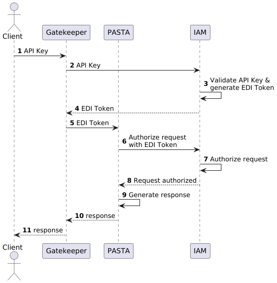

# PEP-15: Authentication with API Keys

- Author(s): Mark Servilla
- Contact: mark.servilla@gmail.com
- Status: Draft
- Type: Application
- Created: 2025-01-25
- Reviewed:
- Final:

## Introduction

The Environmental Data Initiative (EDI) will soon require users to authenticate before being permitted to download data (see [PEP-14](./pep-14.md)), including zip archives of data packages (which contain all the package data). 

## Issue Statement

This change will occur at the point when authorization of a user's request is processed to determine if the request has permission to execute the `readDataEntity` and `downloadZipArchive` REST API methods of the Data Package Manager web service. Authorization is performed by analyzing the user's EDI authentication token, which is passed to the Data Package Manager or Audit Manager by the Gatekeeper reverse proxy service. To simplify this requirement for users who rely on the REST API, we propose that the Gatekeeper accept an API key as an alternative to the EDI authentication token, which will be converted to an EDI authentication token by the IAM service.

## Proposed Solution

We propose that the Gatekeeper accept an API key as an alternative to the EDI authentication token. Ultimately, the API key will be converted to an EDI authentication token by the IAM service and passed to the Data Package Manager or Audit Manager by the Gatekeeper for service and resource authorization (Figure 1).

**Figure 1:** Sequence diagram of the proposed API key flow.

API keys will be generated by any user with an EDI profile through the IAM user interface and provided as a query parameter value in PASTA API requests with `api_key` as the key.

`GET https://pasta.lternet.edu/package/data/eml/edi/23/2/7e0a71d2d7e85344f7029521fe5b8efa?api_key=b559b7a5-5ec1-4f30-b3b2-41331c738e72`

A user may generate multiple API keys for different purposes. Each API key will have an associated expiration date that can be set by the user, with a default expiration date (TBD) if one is not set manually. The user will also be able to revoke an API key at any time. A valid API key will be used by the IAM service to generate an EDI authentication token equivalent to the one generated by a user signing in to the IAM service directly.

## Open issue(s)

1. Key format: UUID or other format?
2. Key default expiration: TBD
3. Key placement: query parameter or header?

## References

...

## Rejection

...
