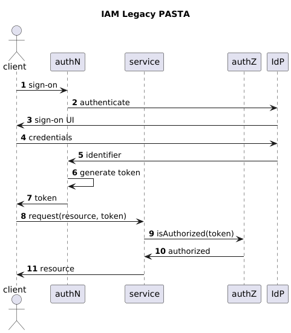
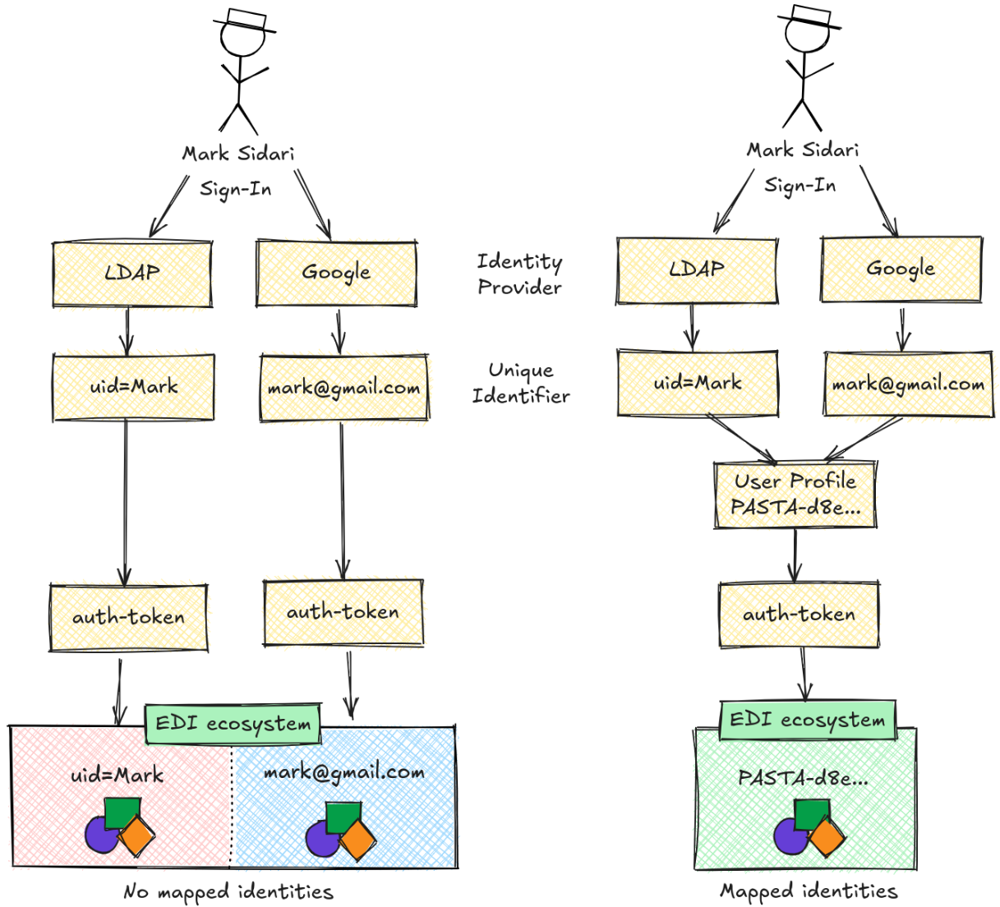

# PEP-7: Upgrading the EDI Identity and Access Management (IAM) Model

Author(s): Mark Servilla  
Contact: [mark.servilla@gmail.com](mailto:mark.servilla@gmail.com)	  
Status: Draft  
Type: Application  
Created: 2024-08-27  
Reviewed:  
Final:

# Introduction

The Environmental Data Initiative (EDI) proposes to upgrade its Identity and Access Management (IAM) model across all its applications. Identity and access management is a framework of policies and technologies ensuring that only users with appropriate permissions can access repository services and data resources. For years, EDI has relied on a local LDAP user registry as its internal identity provider (IdP) for users who need to archive and publish scientific data through the EDI data repository. More recently, EDI has embraced single sign-on (SSO) authentication using external IdPs, providing users with more straightforward options for identity verification, albeit with fewer privileges in EDI applications. Although this approach has worked well over the years, EDI believes that adopting a modern IAM model will significantly improve usability and security throughout EDI in the following areas:

1. User management - by creating distinct EDI "user profiles" for use within EDI applications that do are separate from IdP identifiers, thus providing a consistent and standard identity for use within EDI applications.
2. Group management - by allowing users to create and manage their own "user" groups.  
3. Identity mapping - by allowing users to map IdP identities to a single "user profile."
4. Standardize authentication token - by adopting JSON Web Tokens to convey identity and group information to EDI applications.
5. Support "editable" access control rules - by allowing users to create and modify data resource access control rules.  
6. Address deprecation of `<access>` element in EML 2.2.0 - by supporting `<access>` element content in the `<additionalMetadata>`.

# Background

Understanding the EDI IAM model requires a brief overview of the EDI data repository and its components:

The EDI data repository, which uses the PASTA software, is a web-based system that stores and manages ecological science data, metadata, and quality reports in collections called "data packages." To upload and manage data resources, PASTA provides a set of REST web service API methods written in Java. These API methods and the data packages, including their constituents, are considered "protectable" resources by an authorization system that enforces access control based on permissions granted to users who request access to either the API methods or data resources. The default state of the authorization system is to deny access to all API methods and data resources unless it is explicitly granted in the form of an access control rule (ACR). ACRs are codified using an XML structure of the Ecological Metadata Language (EML) schema called an `<access>` element (Listing 1). ACRs for the web service API methods are stored in a static XML file and loaded into memory when the system starts. ACRs for data resources are defined in the data package's EML metadata file and stored in a databe table called the `access_matrix` for fast access. The `access_matrix` contains multiple fields, but the "data resource," "identity," and "permission" fields are critical for interpreting access control rules. The "data resource" column identifies the specific resource being protected, while the "identity" and "permission" columns define who can access the resource and how. Table 1 illustrates how a single data package can have different access permissions for various users, including those identified by an Orcid identifier, the anonymous "public" identifier, and an authenticated user identifier.

```xml
<access authSystem="https://pasta.edirepository.org/authentication" order="allowFirst" scope="document">
  <allow>
    <principal>uid=mark,o=EDI,dc=edirepository,dc=org</principal>
    <permission>all</permission>
  </allow>
  <allow>
    <principal>public</principal>
    <permission>read</permission>
  </allow>
</access>
```
**Listing 1**: Example of an EML `<access>` element that may be applied to a system or data resource.

| Data Resource                                                                                       | Identity                                           | Access Type | Access Order | Permission |
|-----------------------------------------------------------------------------------------------------|----------------------------------------------------|-------------|--------------|------------|
| <span>https://</span>pasta.lternet.edu/package/data/eml/edi/1220/6/79e0ef272ea569ae12a531306bda59fd | <span>https://</span>orcid.org/0000-0001-6443-XXXX | allow       | allowFirst   | write      |
| <span>https://</span>pasta.lternet.edu/package/data/eml/edi/1220/6/f65f76748fcbbfdac1d48a476ae86794 | <span>https://</span>orcid.org/0000-0001-6443-XXXX | allow       | allowFirst   | write      |
| <span>https://</span>pasta.lternet.edu/package/data/eml/edi/1220/6/d58ab68c88a86a28fc5e46bf05f7edfb | <span>https://</span>orcid.org/0000-0001-6443-XXXX | allow       | allowFirst   | write      |
| <span>https://</span>pasta.lternet.edu/package/metadata/eml/edi/1220/6                              | <span>https://</span>orcid.org/0000-0001-6443-XXXX | allow       | allowFirst   | write      |
| <span>https://</span>pasta.lternet.edu/package/report/eml/edi/1220/6                                | <span>https://</span>orcid.org/0000-0001-6443-XXXX | allow       | allowFirst   | write      |
| <span>https://</span>pasta.lternet.edu/package/eml/edi/1220/6                                       | <span>https://</span>orcid.org/0000-0001-6443-XXXX | allow       | allowFirst   | write      |
| <span>https://</span>pasta.lternet.edu/package/report/eml/edi/1220/6                                | public                                             | allow       | allowFirst   | read       |
| <span>https://</span>pasta.lternet.edu/package/metadata/eml/edi/1220/6                              | public                                             | allow       | allowFirst   | read       |
| <span>https://</span>pasta.lternet.edu/package/eml/edi/1220/6                                       | public                                             | allow       | allowFirst   | read       |
| <span>https://</span>pasta.lternet.edu/package/data/eml/edi/1220/6/f65f76748fcbbfdac1d48a476ae86794 | public                                             | allow       | allowFirst   | read       |
| <span>https://</span>pasta.lternet.edu/package/data/eml/edi/1220/6/d58ab68c88a86a28fc5e46bf05f7edfb | public                                             | allow       | allowFirst   | read       |
| <span>https://</span>pasta.lternet.edu/package/metadata/eml/edi/1220/6                              | uid=mark,o=EDI,dc=edirepository,dc=org             | allow       | allowFirst   | all        |
| <span>https://</span>pasta.lternet.edu/package/report/eml/edi/1220/6                                | uid=mark,o=EDI,dc=edirepository,dc=org             | allow       | allowFirst   | all        |
| <span>https://</span>pasta.lternet.edu/package/eml/edi/1220/6                                       | uid=mark,o=EDI,dc=edirepository,dc=org             | allow       | allowFirst   | all        |

**Table 1**: A snippet of the "access matrix" table showing access control rules for data resources from the same data package. The "Data Resource" column contains unique resource identifiers (those in need of protection); the "identity" column contains user identifiers in various formats, including an Orcid identifier, anonymous "public" identifier, and an authenticated user identifier with the uid of "mark"; the "Access Type" column contains the type of access applied to the permission: either "allow" or "deny"; the "Access Order" column contains the order in which an access type is applied: either "allowFirst" or "denyFirst"; and the "Permission" column contains the permission applied to the identity for the access type.  

The IAM life-cycle for an EDI resource relies on interactions between a user, an identity provider (IdP), and the PASTA IAM services. Multiple IdPs for user authentication are supported (Table 2), including EDI's internal LDAP and four external identity providers: GitHub, Google, Microsoft, and Orcid. Authentication begins when a user provides secret credentials, like a username and password, to an IdP, proving who they claim to be. In turn, the IdP affirms the user's identity by returning a unique IdP user identifier to the authentication service. The authentication service then bundles this unique identifier into a PASTA authentication token, along with the system namespace, a token validity time-to-live (TTL), and a list of groups the user is a member of (Listing 2). When a user requests access to a protected resource (i.e., PASTA web service or data resource), PASTA sends the authentication token and the requested resource identifier to the authorization service. When received, the authorization service decodes the authentication token to reveal the user's identity, including any groups memberships, and then evaluates the request to determine if the user (or groups) has the requisite permission to access the resource. It is important to note that the PASTA authentication token is uniquely designed to operate within the EDI ecosystem and is not a standard token like a JSON Web Token (JWT). See Figure 1 for a UML sequence diagram representation of the legacy PASTA IAM model workflow. 

{ width=50% }

**Figure 1**: Legacy PASTA IAM model workflow for user authentication and resource authorization.

| Identity Provider | Unique Identifier  | Example                                            |
|-------------------|--------------------|----------------------------------------------------|
| EDI LDAP          | Distinguished Name | uid=mark,o=EDI,dc=edirepository,dc=org             |
| GitHub            | Namespace          | <span>https://</span>github.com/mark               |
| Google            | Email              | mark<span>@</span>gmail.com                        |
| Microsoft         | Unique Identifier  | wdKzhHw0bxfW4dT5RNhpXz0h-s7NGR2K54155VI0Wpk        |
| Orcid             | Orcid Identifier   | <span>https://</span>orcid.org/0005-0327-2290-9230 |

**Table 2**: Identity providers and the different types of unique user identifiers returned by each.

```
mark@gmail.com*https://pasta.edirepository.org/authentication*1531891534443*authenticated
```
**Listing 2**: Example of a decoded EDI authentication token with ordered values separated by "*" asterisks. Values are ordered by user identifier, system namespace, time-to-live, and groups.

# Issue Statement

EDI’s IAM model works as expected but can be improved. Its original design was intended for a single community of users, the LTER Network. A locally managed LDAP registry, along with LDAP "distinguished names," was the only framework needed to achieve authentication and authorization goals. Years later, single sign-on (SSO) using third-party identity providers was added to the framework to support LTER sites wishing to track consumers of their data products more effectively. Today, the different identity providers and the simple use of their unique identifiers in the authentication token limits EDI’s ability to serve a broad community user base. The issues follow:

**1. Inconsistent format of unique identities**

The different modalities used for unique identifiers returned by each identity provider complicate matching users with access control rules in several ways. First, users need to know the exact identifier in the authentication token, which must be added into the access control rule of the EML `<access>` element. This is error-prone since the identifier string in both locations must be identical. Moreover, Orcid, and especially Microsoft, identifiers consist of alpha-numeric values that are more difficult to copy and use. To a lesser concern, the unique identifiers are visible to users and expose a level of personal information in the EML metadata and the event logs of EDI’s audit service. 

**2. Inability to create, update, or delete user-owned groups.**

Although the IAM model supports the assignment and evaluation of user groups, the EDI data repository does not allow users to create or manage groups directly. Groups can simplify the creation of access control rules for resource authorization by consolidating sets of users into groups.

**3. Inability to use different identities with a single EDI account.**

Users cannot use multiple identity providers to sign in to the EDI ecosystem and be recognized as the same user for resource authorization. Users must always sign in with the EDI LDAP identity provider when data repository actions require membership in the "vetted" group, even if another identity provider authenticates their identity. In ezEML, this creates numerous user spaces, one for each unique identifier, where work is saved during EML editing sessions. This leads to confusion when users sign in with different identity providers and unintentionally spread their work across different user spaces.

**4. Authentication tokens cannot easily scale.**

Dependence on conveying identity information from the authentication service to clients and the authorization service relies on the structure and scalability of the PASTA authentication token. This token (Listing 1) is based on an ordered list of values, meaning that positional placement is critical to interpreting each value. The lack of a more flexible and scalable approach, like key-value pairs, limits our ability to easily scale the use of the authentication token within the EDI ecosystem for new authentication and authorization models.

**5. Inability to create, update, or delete user-defined access control rules.**

For data resources, all access control rules must be in EML metadata `<access>` elements before publishing the data package. As a result, the user cannot change or modify access rules after the data package is published. Scenarios where users require temporary embargoes on data when publishing an associated journal article or if new users require update privileges to a data package after publication are not possible in the EDI ecosystem.

**6. Deprecation of the \<access\> element in EML 2.2.0.**

The EML 2.2.0 standard used by the EDI data repository and ezEML has officially deprecated the EML metadata `<access>` element. This XML element will eventually be removed from the schema, resulting in validation errors if not removed from the EML metadata document. EDI must provide an alternative mechanism to meet the goal of data resource authorization.

# Proposed Solution

The EDI software development team proposes a multi-faceted solution to ensure the goals of the IAM model are met while expanding the user and group management features provided to end users. Six areas of the IAM model will be upgraded:

**1. User management**

We will introduce a new user profile object to capture the salient information required of a user (e.g., common name, email address, or notification preferences). This profile object will be created upon the first authentication of a user for each distinct identity provider. It will be intrinsically tied to that identity provider through the unique identifier. It will receive a unique identifier (PASTA ID) relevant only to applications of the EDI ecosystem. The PASTA ID will supplant the use of the unique identifiers returned by the identity providers for resource authorization, meaning that PASTA IDs will replace the identity provider's unique identifiers that go into access control rules. The authentication tokens will no longer contain the unique identifier. Instead, the authentication service will insert the PASTA ID into the authentication token for use with resource authorization. This will unify the access control RDBMS table identifiers and eliminate direct exposure of the personal information visible in the identity provider’s unique identifiers (Table 3). We will let users remove their user profile objects, effectively removing them from the EDI ecosystem when all user profile objects of a user no longer exist.

See this EDI PEP for more information about the user profile and PASTA ID in the EDI ecosystem: https://github.com/PASTAplus/PEP/blob/main/peps/pep-2.md.

| Data Resource                                                                                       | Identity                         | Access Type | Access Order | Permission |
|-----------------------------------------------------------------------------------------------------|----------------------------------|-------------|--------------|------------|
| <span>https://</span>pasta.lternet.edu/package/data/eml/edi/1220/6/79e0ef272ea569ae12a531306bda59fd | PASTA-a8809d422e455f9843b9024ed4 | allow       | allowFirst   | write      |
| <span>https://</span>pasta.lternet.edu/package/data/eml/edi/1220/6/f65f76748fcbbfdac1d48a476ae86794 | PASTA-a8809d422e455f9843b9024ed4 | allow       | allowFirst   | write      |
| <span>https://</span>pasta.lternet.edu/package/data/eml/edi/1220/6/d58ab68c88a86a28fc5e46bf05f7edfb | PASTA-a8809d422e455f9843b9024ed4 | allow       | allowFirst   | write      |
| <span>https://</span>pasta.lternet.edu/package/metadata/eml/edi/1220/6                              | PASTA-a8809d422e455f9843b9024ed4 | allow       | allowFirst   | write      |
| <span>https://</span>pasta.lternet.edu/package/report/eml/edi/1220/6                                | PASTA-a8809d422e455f9843b9024ed4 | allow       | allowFirst   | write      |
| <span>https://</span>pasta.lternet.edu/package/eml/edi/1220/6                                       | PASTA-a8809d422e455f9843b9024ed4 | allow       | allowFirst   | write      |
| <span>https://</span>pasta.lternet.edu/package/report/eml/edi/1220/6                                | PASTA-82c934a09235d8903249b8cd92 | allow       | allowFirst   | read       |
| <span>https://</span>pasta.lternet.edu/package/metadata/eml/edi/1220/6                              | PASTA-82c934a09235d8903249b8cd92 | allow       | allowFirst   | read       |
| <span>https://</span>pasta.lternet.edu/package/eml/edi/1220/6                                       | PASTA-82c934a09235d8903249b8cd92 | allow       | allowFirst   | read       |
| <span>https://</span>pasta.lternet.edu/package/data/eml/edi/1220/6/f65f76748fcbbfdac1d48a476ae86794 | PASTA-82c934a09235d8903249b8cd92 | allow       | allowFirst   | read       |
| <span>https://</span>pasta.lternet.edu/package/data/eml/edi/1220/6/d58ab68c88a86a28fc5e46bf05f7edfb | PASTA-82c934a09235d8903249b8cd92 | allow       | allowFirst   | read       |
| <span>https://</span>pasta.lternet.edu/package/metadata/eml/edi/1220/6                              | PASTA-65a821324c98234d98238a5559 | allow       | allowFirst   | all        |
| <span>https://</span>pasta.lternet.edu/package/report/eml/edi/1220/6                                | PASTA-65a821324c98234d98238a5559 | allow       | allowFirst   | all        |
| <span>https://</span>pasta.lternet.edu/package/eml/edi/1220/6                                       | PASTA-65a821324c98234d98238a5559 | allow       | allowFirst   | all        |
**Table 3**: A snippet of the RDBMS table showing access control rules for data resources, but with unified identities that do not disclose personal information. Note that column definitions are identical to Table 1.

**2. Group management**

We will introduce a new group object fully managed by users, allowing them to create, modify, and delete group objects. Like the user profile's PASTA ID, each group object will also receive a PASTA ID, which can also be used in access control rules. Groups will be owned by their creators and have a human-readable name similar to a user’s common name.  However, the group object owner may transfer ownership to another valid user. Groups can only contain users with a valid user profile.

Similar to other repository resources, groups will also be managed as an access-controlled resource. The group creator, as **OWNER**, will have full rights, including the privilege to assign the following permissions to other users in the group:

- **READ** - to see others in the group,
- **WRITE** - to add or delete other users in/from the group, and
- **OWNER** - to modify the permissions of another user in the group and to delete the group (group deletion may occur even if members exist).

A group owner may change their permission, including removing themself from the group, only if at least one other member has the **OWNER** permission.

**3. Identity mapping**

We will provide a mechanism by which a user with at least one valid user profile can link unique identifiers from other identity providers to that profile, thereby recognizing the same user in the EDI ecosystem regardless of their authentication pathway (Figure 2). This process will require first signing in with the identity provider used to create the target profile, then signing in with another identity provider, at which point the two unique identifiers would map to the same target profile. If the newly linked identifier is already associated with another user profile, that other profile will be removed during the mapping process, and any access control rules associated with the now defunct profile will be reassigned with the target profile PASTA ID. We will also allow a user to "unlink" an identifier from a profile. This will enable the user to create a new user profile from the unlinked identifier when the user signs in again with that identity provider.

{ width=75% }

**Figure 2**: Conceptual comparison between the IAM model without identity mapping and with identity mapping. Using unique identifiers creates multiple personas in the EDI ecosystem, leading to confusion with access control rules and how user content is stored in applications like ezEML. In contrast, user profiles and identity mapping allow the EDI ecosystem to recognize "Mark Sidari" as a single person based on a single profile identifier, eliminating confusion. 

**4. Transitioning to JSON Web Tokens (JWT)**

We will replace the PASTA authentication token with a JSON Web Token (JWT). JWTs are an industry standard recognized by the JWT specification, RFC 7519. Since the JWT is a JSON data structure, values are defined using key-value pair notation, eliminating the ambiguity found with the positional values of the PASTA authentication token. JWTs have a standard set of key-value pairs called "registered claims," including definitions for identifying the identity provider, user, audience, and the token time-to-live. JWTs also have "private claims," allowing EDI to add key-value pairs specific to our needs. The following (Listing 3) is an example of a JWT payload:

```json
{
    "iss": "https://authn.edirepository.org",
    "sub": "PASTA-d8e8ba7d848141b3a864cfc6daf97b89",
    "at_hash": "HK6E-P6Dh8y93mRNtsDB1Q",
    "email": "mark@gmail.com",
    "email_verified": "true",
    "iat": 1353601026,
    "exp": 135e604926,
    "hd": "edirepository.org",
    "idp": "google.com",
    "uid": "mark@gmail.com",
    "gn": "Mark",
    "sn": "Sidari",
    "cn": "Mark Sidari"
}
```
**Listing 3**: Example JSON web token payload that could be used as a replacement for the PASTA authentication token. Lines 2 through 10 are "registered claims," and 11 through 15 are "private claims."

An additional benefit of JWTs is that they avoid issues with Cross-Origin Resource Sharing (CORS) restrictions when sent through the HTTP Authorization header as a "Bearer" token.

See this EDI PEP for more information about JSON Web Tokens in the EDI ecosystem: https://github.com/PASTAplus/PEP/blob/main/peps/pep-3.md.

**5. User-managed access control rules**

We will provide a mechanism by which the owner of a data resource or any user who has permission to modify access control rules of a data resource can create, modify, and delete access control rules for that data resource post-publication of the data package. This mechanism will allow that user to search for other users with a valid user profile or a group owned by a user with a valid user profile and create a new access control rule that will assign permission to "read," "update," or "all/change_permissions" to that data resource using the PASTA IDs of the other users or groups, respectively. This mechanism will also allow that user to modify the permissions of an existing access control rule for a data resource or delete the access control rule for a data resource. The benefit of allowing post-publication user-managed access control rules is that users can decide who and when access should be permitted to their data resources.

**6. Addressing deprecation of EML 2.2.0 `<access>` element**

We will modify the process by which EML 2.2.0 (or greater) parses and extracts access control rules from the EML metadata `<access>` element to one that identifies similar access control rule schemas within the `<additionalMetadata>` element of the EML document (the `<additionalMetadata>` element of the EML metadata schema permits any valid XML content that is not within the EML schema namespace). We will continue to extract access control rules using the existing `<access>` elements of the EML metadata for EML versions before and up to 2.2.0, but be ready for versions greater than 2.2.0 if the `<access>` element is no longer schema-valid. We believe access control rules within the EML metadata are important for scenarios where users would like a default set of access control rules added as part of the publication workflow.

# Open issue(s)

**1. ezEML user spaces**

ezEML currently creates a user space based on the identity provider's unique identifier in the authentication token. The same user may have multiple ezEML user spaces, one for each unique identifier. Mapping unique identifiers to a single user profile poses some risk to ezEML users if the separate user spaces are merged into a single user space based on the new user profile PASTA ID: the same EML data package information may occur in two or more user space locations for the same user and merging in the wrong order may affect the most accurate version of the data package information. Suggested options include:

1. Use the user profile PASTA ID to create a new user space and provide a mechanism to manually copy data package information from older user spaces into the PASTA ID user space.  
2. Retain the identity provider's unique identifiers in the authentication token based on the most recent authentication and sign in the ezEML user with that unique identifier, allowing access to an older user space.

**2. JSON Web Tokens**

1. The transport protocol in the HTTP Authorization header for JWTs will affect any non-EDI client using PASTA authentication tokens for replay requests since the authentication tokens are sent through the request's Cookie header. A suggested solution is to insert the JWT in both the Authorization and Cookies headers until a recommended deprecation period is met and then transition to only using the Authorization header.  
2. Embracing JWTs will require rewriting PASTA’s internal decoding of authentication tokens. To avoid a complete rewrite, only public-facing services (e.g., Data Portal, Gatekeeper, and ezEML) would initially need to support JWTs. The Gatekeeper could decode the JWT as the externally defined token and recast essential information into a PASTA authentication token for internal purposes.

# References

1. About Oauth2: https://oauth.net/2/  
2. About JSON web Tokens: https://jwt.io/introduction  
3. JSON Web Token standard RFC 7519: [https://datatracker.ietf.org/doc/html/rfc7519](https://datatracker.ietf.org/doc/html/rfc7519)  
4. About the EML metadata standard: https://eml.ecoinformatics.org/  
5. EML schema normative documentation: [https://eml.ecoinformatics.org/schema/](https://eml.ecoinformatics.org/schema/)  
6. Schema changes in EML 2.2.0: https://eml.ecoinformatics.org/whats-new-in-eml-2-2-0
