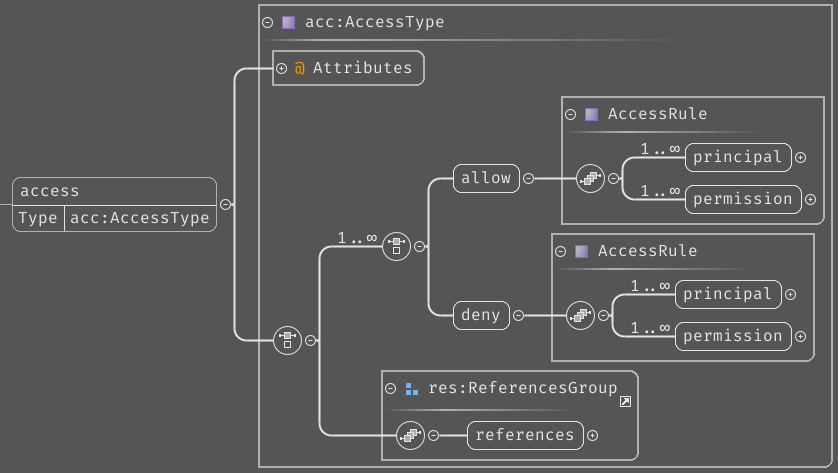
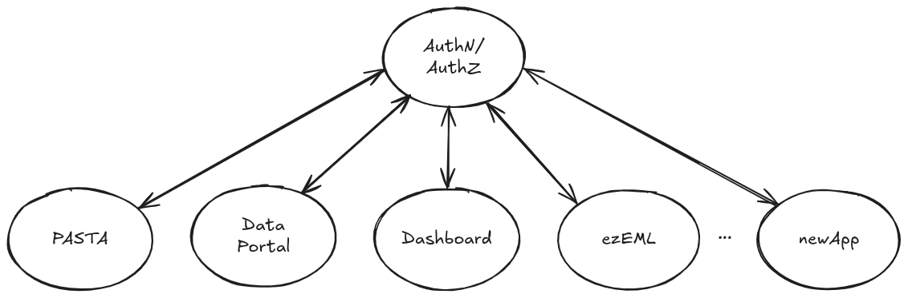
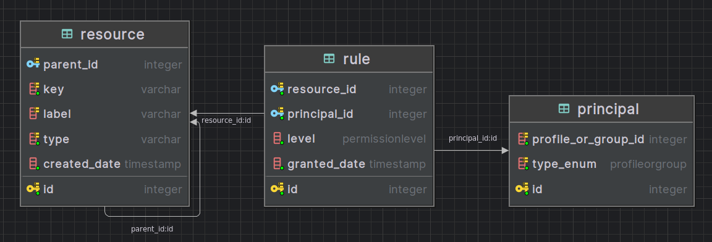

# PEP-9: Implementing Authorization of the IAM Model
- Author(s): Mark Servilla
- Contact: mark.servilla@gmail.com
- Status: Draft
- Type: Application
- Created: 2024-11-24
- Reviewed:
- Final:


## Introduction

Protecting resources through access control is a critical component of the EDI Identity and Access Management (IAM) model (see [PEP-7](./pep-7.md)). At this time, access control is only applied within the EDI data repository through a simplified attribute-based access control (ABAC) model written into the PASTA software and ezEML, which uses a discretionary access control (DAC) model where only resource owners have access to their resources. The following discussion pertains primarily to the ABAC model in use by the data repository. Topics relevant to ezEML will be noted specifically.

The ABAC model determines if an individual is privileged to execute a PASTA API method or to upload, access, or remove a data package, or resources (i.e., metadata, data, and quality report) of the data package, from the EDI data repository. Privileges are declared in an access control rule (ACR) using the `<access>` element (Figure 1) syntax defined in the [Ecological Metadata Language](https://eml.ecoinformatics.org/schema/eml_xsd#eml_access) (EML) XML schema. The *principal* (or subject) of an access control rule is the unique user identity assigned by an Identity Provider (IdP) or an arbitrary group identifier (e.g., "authenticated") assigned by the system.  The *permissions* (or privileges) of an ACR are defined as "read," "write," or "changePermission." These map to the following:

* **read** to "read" a resource,
* **write** to the union of "create, read, update, and delete" a resource, and
* **changePermission** to everything in *write* and the privilege to "change the permission" of a resource ("all" may be substituted for "changePermission" in ACRs).

These permissions are not part of the EML `<access>` element schema; they are legacy and were defined by the Long Term Ecological Research (LTER) Network information management community.

<!--{ width=65% }-->

**Figure 1:** XML schema diagram for an Ecological Metadata Language `<access>` element.

An ACR may be read as an [RDF triple](https://www.w3.org/TR/rdf11-concepts/#section-triples), where the *principal* is the **subject**, the combination of either "allow" or "deny", along with the *permission*, is the **predicate**, and the resource under the protection of the ACR is the **object**. For example, the following `<access>` element (Listing 1) in a metadata document describing data contained in the file `table.csv` can be read informally as "the user, `uid=mark,o=EDI,dc=edirepository,dc=org`, *has permission to read* the data contained within `table.csv`." Although a "deny" verb is permitted in an `<access>` element to explicitly revoke a privilege on a resource, it is rarely used in practice. One or more ACRs may be combined within a single `<access>` element (as permitted by the XML schema), forming an Access Control List (ACL), where multiple subjects and predicates govern a single resource object.

```xml
<access>
  <allow>
    <principal>uid=mark,o=EDI,dc=edirepository,dc=org</principal>
    <permission>read</permission>
  </allow>
</access>
```
**Listing 1:** Example of an Ecological Metadata Language `<access>` element. 

ACLs for PASTA API methods are declared in a standalone XML document file, `service.xml`, one each for the Data Package Manager (DPM) and Audit Manager (AM) services. These ACLs are read into the system during the PASTA bootstrap process and can be changed by editing the file and restarting the system. ACLs for data package resources held in the data repository are declared in the data package's EML metadata document and are translated into the `access_matrix` RDBS table at the time when the data package EML is first uploaded into the repository; these ACRs cannot be modified once they are read into the table. Both the `service.xml` file and EML metadata use the same XML `<access>` element structure, allowing use of the same ACR processor to determine authorization.

For ezEML, there is an implicit **write** permission for the owner of a resource. In this case, the owner is identified through the IdP identifier provided through the PASTA authentication token. Resources are held in filesystem directories that map to the owner's identifier and only the owner of the directory may create or modify resources within it.

This PEP proposes the development of an independent EDI *Authorization service* to replace internal authorization processing used by the DPM and AM services, and will be available for use by ezEML. This service will improve authorization for applications within the EDI ecosystem in three significant ways: (1) it will provide an ecosystem-wide, centralized service available to all EDI applications; (2) it will replace IdP user identifiers and group identifiers found in the existing `access_matrix` table with *PASTA IDs* ([see PEP-2](./pep-2.md)) generated by the EDI *Authentication service*; and (3) it will allow users to modify resource ACRs, including adding new ACRs or deleting existing ACRs, at anytime, if they have permission to do so. This last feature significantly alters the current access managemnent model for data packages by allowing data package owners to modify ACRs post-publication.

## Issue Statement

The current use of authorization within EDI applications has the following issues:

1. IdP user identifiers and group identifiers are embedded in ACRs, which are visible to the public by reviewing the data package XML metadata. This can disclose private or sensitive information, including names, email addresses, and alternative identifiers (e.g., Orcid identifiers). These identifiers also become a permanent record in the EDI data repository audit log, which is another potential exposure route of sensitive information.
2. Data package resource ACRs become immutable once the data package is published in the EDI data repository. This poses significant hardship for data package creators or owners who wish to apply a temporary embargo to data resources during manuscript review or to modify, add, or delete ACRs when managing personnel change over time.
3. Outside of the EDI data repository, authorization processing of ACRs is not supported. This significantly limits reusability of authorization technology and the scalability of the IAM model for other EDI applications in general.
4. Because of the DAC model used by ezEML, sharing access to resources is only possible through an internal system that must be invoked on an ad-hoc basis.

## Proposed Solution

We propose to implement a stand-alone authorization service, **AuthZ**, that will manage ACRs for all applications in the EDI ecosystem, including the EDI data repository and ezEML, and complement the new authentication service, **AuthN**, by working seamlessly with PASTA unique identifiers assigned to users and groups (Figure 2). AuthZ will provide a REST API for managing ACRs, including the ability to add, modify, and delete ACRs for data package resources. It will also provide a mechanism for managing PASTA service API method ACRs. AuthZ will be designed as microservice, augmented with a web UI frontend, that integrates with the existing EDI architecture and will be implemented in Python using the FastAPI web framework.

This service will be responsible for the following:

1. Implement a secure and verifiable authorization algorithm that will process ACRs for EDI related resources.
2. Be extensible to support all applications in the EDI ecosystem.
3. Maintain a secure and private ACR registry with the necessary attributes to perform authorization based on #1.
4. Provide a REST API for managing ACRs, including the ability to add, modify, and delete ACRs.
5. Self-authorize requests to the REST API using a JSON Web Token (JWT) issued by the AuthN service.
5. (TBD) Provide a web UI frontend for managing ACRs for both EDI administrators and users.

<!--{ width=50% }-->

**Figure 2:** Proposed EDI application ecosystem with the addition of the AuthZ service.

### AuthZ Access Control Rule Registry

The AuthZ ACR registry will be implemented as RDBMS tables with the following schema (Figure 3):



**Figure 3:** AuthZ ACR registry table schema.

The primary function of the ACR Registry is to store ACRs for all applications in the EDI ecosystem. We use a structure with collections, resources and permissions. A collection contains zero to many resources, and a resource contain zero to many permissions. Each permission provides read, write or changePermission to either a user profile, a user group, or to the public user.

- `id` - Auto-incrementing integers that uniquely identify each table row.
- `collection.label` - A human-readable name to display for the collection.
- `collection.type` - A string that describes the type of the collection.
- `resource.collection_id` - Reference to the collection to which the resource belongs.
- `resource.label` - A human-readable name to display for the resource.
- `resource.type` - A string that describes the type of the resource.
- `permission.resource_id` - Reference to the resource to which the permission belongs.
- `permission.grantee_id` - Reference to the user profile or user group to which the permission is granted. If the grantee is public, the grantee_id is NULL.
- `permission.grantee_type` - An enumeration of possible values that represent the type of grantee, one of, 'PROFILE', 'GROUP' or 'PUBLIC'.
- `permission.level` - An enumeration of possible values that represent the permission level, one of, 'READ', 'WRITE' or 'CHANGE'.

E.g., if we are tracking permissions for a data package with data and metadata entities, the `collection.label` might be `knb-lter-bes.1234.5`, and the `collection.type` would be `package`. Linked to this collection would be a number of resources. Each resource would have a `resource.collection_id` referencing the `knb-lter-bes.1234.5` collection, a `resource.label` with an entity name or package URL, and a `resource.type` of either `data` or `metadata`. Permissions would then be linked to these resources via `permission.resource_id`. Each permission would have a `permission.grantee_id` of a user profile, group or NULL (for the public user), and a `permission.grantee_type` of either `PROFILE`, `GROUP` or `PUBLIC`. The `permission.level` would specify the level of access granted to the grantee, and would be one of `READ`, `WRITE` or `CHANGE`.


### AuthZ authorization algorithm

Premises for the AuthZ authorization algorithm are as follows:

1. All principals are denied access to all resources unless an ACR exists that explicitly allows access.
2. An ACR only defines "allow" access to a resource. "Deny" access is not supported.
3. If multiple ACRs exist for a resource that affect the same user, the most permissive ACR is applied. For example, if one ACR allows read access and another allows write access, the write access is applied. Similarly, if one ACR allows read access for a user and another allows write access for a group to which the user belongs, the write access is applied.

The AuthZ authorization algorithm requires three parameters:

1. The resource identifier to be accessed.
2. The set of principals attempting to access the resource.
3. The requested permission for the resource. The permission is an integer value that represents the access level requested by the principal (read = 1, write = 2, changePermission = 3).

The algorithm is as follows:
```python
def is_authorized(resource: str, principals: set, permission: int) -> bool:
    authorized = False
    acrs = getACRs(resource)
    for principal in principals:
        for acr in acrs:
            if acr.principal == principal:
                if acr.permission <= permission:
                    authorized = True
    return authorized
```
### PASTA Integration

There are three primary integration points between AuthZ and PASTA:

1. Data package resource ACR registration ([see UML here](./images/pep9-data_package_resource_add_ACL-Data_Package_Life_Cycle_Authorization.png)).
2. Service method authorization ([see UML here](./images/pep9-service_method_authZ-Service_Method_Authorization.png)).
3. Data package resource authorization ([see UML here](./images/pep9-data_resource_authZ-Read_Resource_Authorization.png)).

Each integration point is selected to minimize the impact on the existing PASTA architecture and to provide a seamless transition to the new AuthZ service.

### Use Case and REST API Method Definitions

**1a. Add ACL**

Goal: To parse a valid EML document and add its ACRs to the AuthZ ACR registry.

Use case:

1. A user uploads a data package with an EML metadata document.
2. PASTA creates a Level-1 EML metadata document and sends the EML to AuthZ to register package ACRs.
3. AuthZ parses the EML and extracts the ACRs.
4. AuthZ adds the ACRs to the ACR registry.
5. AuthZ returns a success message to PASTA.

Notes: This use case supports the existing PASTA data package upload process. Parsing and extracting ACRs from the EML document will require supporting ACRs in both the main EML document and the additional metadata section. The principal owner of the data package is not currently represented in the ACR registry. This should, however, change for consistency: the principal owner should be added into the ACR registry with the "changePermission" permission.

```
addACL(owner: string, eml: string)
    owner: owner of data package resources (derived from "sub" of JWT) as a string
    eml: valid EML document as a string
    return:
        200 OK if successful
        400 Bad Request if EML is invalid
    permissions:
        system: changePermission
```

**1b. Add ACL**

Goal: To parse a valid `<access>` element and add its ACRs to the AuthZ ACR registry.

Use case:

1. An EDI application creates an `<access>` element ACL for an EDI resource.
2. The application sends the `<access>` element ACL to AuthZ to register the ACR.
3. AuthZ parses the `<access>` element ACL and extracts the ACRs.
4. AuthZ adds the ACRs to the ACR registry.
5. AuthZ returns a success message to the EDI application.

Notes: This use case supports adding ACLs for PASTA API methods through the `service.xml` file. In this case, the `service.xml` file is not a complete EML document; they consist of ACLs in the form of `<access>` elements. The principal owner of the service method (or other resource) should be added into the ACR registry with the "changePermission" permission; in the case of service methods, the principal owner will be "pasta."

```
addACL(owner: string, access: string)
    owner: owner of resource (derived from "sub" of JWT) as a string
    access: valid <access> element as a string
    return:
        200 OK if successful
        400 Bad Request if <access> element is invalid
    permissions:
        system: changePermission
```

**2. Add ACR**

Goal: To add an individual ACR as defined by ACR attributes to the AuthZ ACR registry.

Use case:

1. An EDI application creates an ACR for an EDI resource.
2. The application sends the ACR to AuthZ to register the ACR.
3. AuthZ validates and adds the ACR to the ACR registry.
4. AuthZ returns a success message to the EDI application.

Notes: This use case supports adding individual ACRs for applications that do not use EML or `<access>` elements.

```
addACR(resource_id: string, principal: string, permission: string)
    resource_id: the resource identifier of the resource to be protected by the ACR as a string
    principal: the principal of the ACR as a string
    permission: the permission of the ACR as a string
    return:
        200 OK if successful
        400 Bad Request if ACR is invalid
    permissions:
        system: changePermission
        vetted: write
```

**3. Delete ACR**

Goal: To delete an individual ACR from the AuthZ ACR registry.

Use case:

1. An EDI application selects an ACR identifier, identifying an ACR that should be deleted from the ACR registry.
2. The application sends the ACR identifier to AuthZ to delete the ACR.
3. AuthZ deletes the ACR from the ACR registry.
4. AuthZ returns a success message to the EDI application.

Notes:

```
deleteACR(acr_id: int)
    acr_id: the ACR identifier of the ACR to be removed as an integer
    return:
        200 OK if successful
        404 Bad Request if ACR is not found in the ACR registry
    permissions:
        system: changePermission
        vetted: write
```

**4. Update ACR**

Goal: To update an individual ACR in the AuthZ ACR registry.

Use case:

1. An EDI application selects an ACR identifier, identifying an ACR that should be updated in the ACR registry.
2. The application sends the ACR identifier, along with the new ACR attributes, to AuthZ to update the ACR.
3. AuthZ updates the ACR in the ACR registry.
4. AuthZ returns a success message to the EDI application.

Notes: This use case can also be accomplished by deleting the ACR and adding a new ACR with the same ACR attributes; however, doing so would require two API calls and result in a new ACR identifier.

```
updateACR(acr_id: int, resource_id: string, principal: string, permission: string)
    acr_id: the ACR identifier of the ACR to be removed as an integer
    resource_id: the resource identifier of the resource to be protected by the ACR as a string
    principal: the principal of the ACR as a string
    permission: the permission of the ACR as a string
    return:
        200 OK if successful
        404 Bad Request if ACR is not found in the ACR registry
    permissions:
        system: changePermission
        vetted: write
```

**5. Read ACR**

Goal: To read the attributes of an individual ACR in the AuthZ ACR registry based on the resource identifier.

Use case:

1. A client application selects an ACR by providing a resource identifier.
2. The application sends the resource identifier to AuthZ.
3. AuthZ verifies the client application has privileges to read the ACR.
4. AuthZ returns the attributes of the ACR based on the resource identifier.

Notes: None

```
readACR(resource_id: string)
    resource_id: the resource identifier of the resource to be protected by the ACR as a string
    return:
        200 OK if successful
        404 Bad Request if ACR is not found in the ACR registry
    permissions:
        system: changePermission
        vetted: write
```

**6a. Is Authorized**

Goal: To determine if a principal is authorized to access a resource.

Use case:

1. An EDI application collects the user's authentication token, the `<access>` element for the protected resource, and the requested permission.
2. The application sends the token, `<access>` element, and permission to AuthZ to determine if the user is authorized.
3. AuthZ processes the request and returns a success message if the user is authorized.

Notes: This use case supports the authorization process for PASTA API methods if the ACLs in the  `service.xml` file are not registered in AuthZ's ACR registry.

```
isAuthorized(token: string, access: string, permission: string)
    token: a valid PASTA authentication token as a string
    access: a valid <access> element as a string
    permission: the permission to be checked as a string
    return:
        200 OK if authorized
        403 Forbidden if not authorized
    permissions:
        system: changePermission
```

**6b. Is Authorized**

Goal: To determine if a principal is authorized to access a resource.

Use case:

1. An EDI application collects the user's authentication token, the resource identifier for the protected resource, and the requested permission.
2. The application sends the token, resource identifier, and permission to AuthZ to determine if the user is authorized.
3. AuthZ processes the request and returns a success message if the user is authorized.

Notes: This use case supports the authorization process for data package resources where it is assumed that ACRs exist in the ACR registry.

```
isAuthorized(token: string, resource_id: string, permission: string)
    token: a valid PASTA authentication token as a string
    resource_id: the resource identifier of the resource to be accessed as a string
    permission: the permission to be checked as a string
    return:
        200 OK if authorized
        403 Forbidden if not authorized
    permissions:
        system: changePermission
```

**6c. Is Authorized**

Goal: To determine if a principal is authorized to access a resource.

Use case:

1. An EDI application collects the user's JSON Web Token, the `<access>` element for the protected resource, and the requested permission.
2. The application sends the token, `<access>` element, and permission to AuthZ to determine if the user is authorized.
3. AuthZ processes the request and returns a success message if the user is authorized.

Notes: This use case supports the authorization process for PASTA API methods if the ACLs in the  `service.xml` file are not registered in AuthZ's ACR registry.

```
isAuthorized(jwt: string, access: string, permission: string)
    jwt: a valid JSON Web Token as a string
    access: a valid <access> element as a string
    permission: the permission to be checked as a string
    return:
        200 OK if authorized
        403 Forbidden if not authorized
    permissions:
        system: changePermission
```

**6d. Is Authorized**

Goal: To determine if a principal is authorized to access a resource.

Use case:

1. An EDI application collects the user's JSON Web Token, the `<access>` element for the protected resource, and the requested permission.
2. The application sends the token, `<access>` element, and permission to AuthZ to determine if the user is authorized.
3. AuthZ processes the request and returns a success message if the user is authorized.

Notes: This use case supports the authorization process for PASTA API methods if the ACLs in the  `service.xml` file are not registered in AuthZ's ACR registry.

```
isAuthorized(jwt: string, access: string, permission: string)
    jwt: a valid JSON Web Token as a string
    resource_id: the resource identifier of the resource to be accessed as a string
    permission: the permission to be checked as a string
    return:
        200 OK if authorized
        403 Forbidden if not authorized
    permissions:
        system: changePermission
```
### Implementation Strategy for PASTA

The **AuthZ** service must integrate seamlessly into PASTA's current authorization workflow. Two aspects of this integration must be addressed: (1) the existing `access_matrix` database table must be migrated and updated with PASTA identifiers and (2) the PASTA Data Package Manager (DPM) service will need to be modified to use REST API methods of the **AuthZ** service (above) in lieu of its internal authorization logic.

#### Access_matrix Migration

1. An **AuthZ** `access_matrix` database table (see *AuthZ Access Control Rule Registry* [above](https://github.com/PASTAplus/PEP/blob/main/peps/pep-9.md#authz-access-control-rule-registry)).
2. 


#### Updating the Data Package Manager Service


## Open issue(s)

### 1. Will AuthZ support "deny" verbs in ACRs?

Because the "deny" verb is rarely used in practice, it will not be supported in the initial implementation of the AuthZ service. However, this feature may be added in a future release.

### 2. How will the current `DataPackageManager.access_matrix` table be migrated to the AuthZ ACR registry?

### 3. How will ezEML interact with the AuthZ service?

### 4. Will the data package "principal" owner be represented in the ACR registry?

Currently, the data package owner is passed to the "isAuthorized" method through a separate parameter, `principalOwner`, which is obtained by querying the data package manager resource registry. The `principalOwner` is compared to the submitter of the resource access request to determine if the submitter is the owner of the data package, and if so, the submitter is granted "changePermission" access to the data resource in question without the need for an ACR. This is an implicit ACR that is not stored in the ACR registry.

### 5. How will legacy `<access>` elements that contain IdP user identifiers and group identifiers work within the AuthZ service?

### 6. Should AuthZ expose a UI for managing ACRs or should each client application provide its own UI?

## References

...

## Rejection

...
