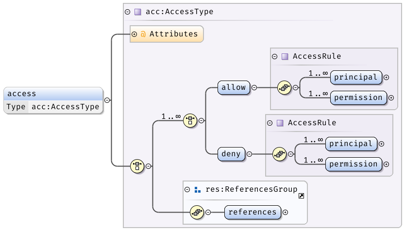
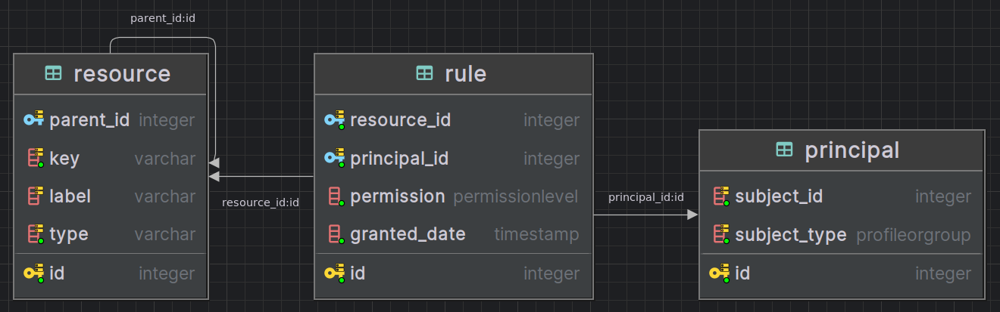

# PEP-9: Implementing Authorization of the IAM Model
- Author(s): Mark Servilla, Roger Dahl, Jon ide
- Contact: mark.servilla@gmail.com
- Status: Draft
- Type: Application
- Created: 2024-11-24
- Reviewed:
- Final:

## Introduction

Protecting digital resources through access control is paramount to the EDI Identity and Access Management (IAM) model (see [PEP-7](./pep-7.md)). Digital resources in the EDI ecosystem can be anything, including the elements of a data package (e.g., metadata, quality report, or data), web-service API methods, the scope values of data package identifiers, web-application actions (e.g., forms or links), or metadata models created and edited in *ezEML*. These resources require protection from malicious and non-malicious actions through access control rules (ACRs), which codify how a user of an EDI application may act upon a resource.

The following PEP proposes the development of an *authorization service* that unifies access control across all EDI applications. It will improve application scalability and eliminate the idiosyncratic access control behavior of "stove-pipe" solutions. A single *authorization service* will significantly improve EDI's IAM model in three ways:

1. It will provide an ecosystem-wide, centralized service with a standard interface available for use by all EDI applications to manage access control rules.
2. It will use *PASTA IDs* ([see PEP-2](./pep-2.md)) generated by the EDI *authentication service* in lieu of IdP identifiers (which border on  personally identifiable information).
3. It will allow access control rules for resources to be created and modified at any time.

## Background

Historically, access control for EDI revolved around the core repository, PASTA, where static access control rules, codified in user-provided [Ecological Metadata Language](https://eml.ecoinformatics.org) (EML) metadata documents, dictated who may read and update the science metadata and data of a data package. These ACRs are declared using the [`<access>`](https://eml.ecoinformatics.org/schema/eml_xsd#eml_access) element (Figure 1) of the EML XML schema (multiple rules can be defined within a single `<access>` element, creating an access control list (ACL)).

<!--{ width=65% }-->

**Figure 1:** XML schema diagram for an Ecological Metadata Language `<access>` element.

For an EML `<access>` element (see example in Listing 1), the access control rule can either "allow" or "deny" access to the data package's resources (the specific resource in question depends on where in the document the rule is defined). The type of access enforced by the rule is defined by `<access>` sub-elements `<allow>` and `<deny>` (although a "deny" action is permitted to explicitly revoke a privilege on a resource, it is rarely used in practice). Within an `<allow>` or `<deny>` element, the subject and privilege of the ACR is defined by the `<principal>` and `<permission>` sub-elements. For EDI, the value of the `<principal>` element can be any string but generally consists of the unique identity assigned to a user by an Identity Provider (IdP) or is an arbitrary group identifier (e.g., "authenticated"). In contrast, the value of the `<permission>` element can only be one of the following:

* **read** (to gain immutable "read" access to a resource),
* **write** (to gain mutable "create", "read" , "update", and "delete" access to a resource), or
* **changePermission** (to everything in *write*, along with the privilege to alter another's access to a resource).

(These specific permissions are not part of the EML `<access>` element schema; they are legacy and were defined by the Long Term Ecological Research (LTER) Network information management community.)

```xml
<access>
  <allow>
    <principal>uid=mark,o=EDI,dc=edirepository,dc=org</principal>
    <permission>read</permission>
  </allow>
</access>
```
**Listing 1:** Example definition of an Ecological Metadata Language `<access>` element. If found in metadata describing data in a file named `table.csv`, this ACR can be read informally as "the user, `uid=mark,o=EDI,dc=edirepository,dc=org`, *is allowed permission to read* the data contained within `table.csv`."

> *Side note*: An `<access>` element ACR may be read as an [RDF triple](https://www.w3.org/TR/rdf11-concepts/#section-triples) **<subject, predicate, object>**, where the *principal* in the ACR is the **subject**, the combination of either "allow" or "deny", along with the *permission*, is the **predicate**, and the protected resource is the **object**.

ACLs for PASTA API methods are declared in a standalone XML document file, `service.xml`, one each for the Data Package Manager (DPM) and Audit Manager (AM) services. These ACLs are read into the system during the PASTA bootstrap process and can be changed by editing the file and restarting the system.

ACLs for data package resources are declared in the data package's EML metadata document and are translated from XML and stored in the `access_matrix` RDBS table as single ACRs when the data package EML is first uploaded into the repository; these ACRs cannot be modified once they are entered into the table. Data package ACLs can occur at two levels: (1) at the "data package" level, which sets the permissions for all data package resources (i.e., metadata, quality report, and data entities) and (2) at the "data entity" level, which sets permissions for individual data entities and overides permissions set at the "data package" level (it is not uncommon to set "public" read access to the metadata and quality report, but restrict "public" access to data entities).

Both the `service.xml` file and EML metadata use the same XML `<access>` element structure, allowing use of the same ACR processor to determine authorization. In both cases, ACRs allowing access to resources must be explicitly granted, otherwise the resource request is denied.

For ezEML, there is an implicit **write** permission for the owner of a resource. In this case, the owner is identified through the IdP identifier provided through the PASTA authentication token. Resources are held in filesystem directories that map to the owner's identifier, and only the owner of the directory may create or modify resources within it. There is an exception to this rule where the owner of the resource may grant temporary **write** access to another user of ezEML, enabling collaboration. This process, however, does not provide permanent access to the resource and is revoked when the proxy user completes their actions.

## Issue Statement

The current use of access management within EDI applications has the following issues:

1. Applications within the EDI ecosystem are faced with designing and implementing access management processing in isolation. This leads to idiosyncratic, non-interoperable solutions for a customer base that transcends all EDI applications, resulting in confusion and, at worst, security breaches.
2. IdP user identifiers and group identifiers are embedded in existing ACRs, which are visible to the public by reviewing the data package XML metadata. This can disclose private or sensitive information, including names, email addresses, and alternative identifiers (e.g., Orcid identifiers). These identifiers also become a permanent record in the EDI data repository audit log, which is another potential exposure of sensitive information.
3. Existing ACRs used in most EDI applications, especially those used for data package resources, are static and immutable once defined. Access control for resources should be dynamic so administrators and users alike can easily create new ACRs, as well as modify and update existing ACRs. In practice, this would allow a resource owner to add (or remove) access to the resource for a user during the life-time of the resource, not just when the resource is created.

## Proposed Solution

We propose to design and implement an *authorization service* that will perform access management for all types of resources used within EDI applications (Figure 2). Because this service shares related content with the authentication service, both services will be combined and operate on the same server using the same Python FastAPI web framework and PostgreSQL database.

This service will be responsible for the following:

1. Implement a secure and verifiable authorization algorithm that will process ACRs for EDI resources.
2. Support all applications and their respective resources in the EDI ecosystem.
3. Maintain a secure and private ACR registry with the necessary attributes to perform authorization based on #1.
4. Provide a REST API for managing ACRs, including the ability to add, modify, and delete ACRs by users who have "changePermission" privileges to the resource (i.e., an owner of the resource).
5. Provide a web browser UI frontend for managing ACRs for both EDI administrators and users.

<!--{ width=50% }-->

**Figure 2:** Proposed EDI application ecosystem with the addition of an authorization service.

**TODO: This section needs to be rewritten with the current model in mind**

### Access Control Rule Registry

The ACR registry will be implemented as RDBMS tables with the following schema (Figure 3):



**Figure 3:** Authorization service ACR registry table schema.

The ACR Registry will store ACRs for all application resources in the EDI ecosystem. We will use a structure with *resources*, *rules*, and *principals*:

#### Resource

A resource may be singular or consist of a hierarchical set (as for data packages) where a resource object is the child of another resource, forming a directed acyclic graph (DAG) where children may have only one parent. Resources have zero to many access rules, each containing a permission and a principal, the subject of the rule. Resources are identified by a unique key provided by the application and a human-readable label (the label does not have to be unique).

- `resource.id` - Row ID of the resource (referenced in rules).
- `resource.parent_id` - An optional reference to a parent resource, making this resource a child of the parent resource.
- `resource.key` - A unique system identifier for the resource.
- `resource.label` - A human-readable name for the resource.
- `resource.type` - The resource type.

#### Rule

 Each rule uniquely maps a resource to a principal subject (i.e., user profile or group) and a permission (*read*, *write* or *changePermission*), defining how the principal can access the resource.

- `rule.id` - Row ID of the rule.
- `rule.resource_id` - A reference to the resource to which the rule applies.
- `rule.principal_id` - A reference to the user profile or group to which the rule is granted.
- `rule.permission` - The access permission granted by this rule (enum of `read`, `write` or `changePermission`).
- `rule.granted_date` - The grant date and time of the rule.

#### Principal

The principal references either a user profile or a group. A user profile can be a regular user or a system-level user, such as the "public" user; both regular and system users will have a unique EDI-ID.

- `principal.id` - Row ID of the principal (referenced in rules).
- `principal.subject_id` - A reference to the subject, either a profile or group.
- `principal.subject_type` - The principal subject type (enum of `PROFILE` or `GROUP`).

For example, if we are tracking permissions for a data package with metadata and data entities, we would set up an inverted tree (DAG) of resources (Figure 4). The `resource.label` of the root resource might be `knb-lter-bes.1234.5`, and the `resource.type` would be `package`. To this parent, we would add two child resources of `resource.type` `collection` and with labels `data` and `metadata`. These child resources would then have their own children, representing the individual data and metadata entities in the package. So a resource with parent `data` might have `resource.label` of `water.csv` while the `resource.key` would be the PASTA URI `https://pasta.lternet.edu/package/data/eml/knb-lter-bes.1234.5/3fb3ef2e559fa42956b69226e9069058`. The `resource.type` would be `data`. Rules would then be linked to these resources via `rule.resource_id`. Each rule would have a `rule.principal_id` of a user profile or user group. The `rule.permission` would specify the permission of access granted to the principal, and would be `read`, `write` or `changePermission`. The principal would be linked to the `principal.id` of the principal table. The `principal.subject_id` would be the row ID of a row in the Profile or Group table, and `principal.subject_type` would be `PROFILE` or `GROUP`.


**Figure 4:** Resource tree for a data package with metadata and data entities.

### Authorization algorithm

Premises:

1. All principals are denied access to all resources unless an ACR exists that explicitly grants access for the principal to the resource.
2. An ACR will only support "allow" access to resources; "deny" access will not be supported.
3. If multiple ACRs exist pertaining to the same principal and the same resource, but with different permissions, then the most permissive permission will be granted. (For example, if one ACR allows read access and another allows write access, the write access is applied. Similarly, if one ACR allows read access for a user and another allows write access for a group to which the user belongs, then write access is applied.)

The authorization algorithm requires three parameters:

1. The resource identifier to be accessed.
2. The set of principals (either a user profile or groups) attempting to access the resource (as determined from the authentication token).
3. The requested permission for the resource (*read*, *write*, *changePermission*).

The algorithm is as follows:
```python
def is_authorized(resource, principals, permission) -> bool:
    authorized = False
    acl = getACL(resource)
    for principal in principals:
        for acr in acl:
            if acr.principal == principal:
                if acr.permission >= permission:
                    authorized = True
    return authorized
```
### PASTA Integration

There are three primary integration points between the *authorization service* and PASTA:

1. Data package resource ACR registration ([see UML here](./images/pep9-data_package_resource_add_ACL-Data_Package_Life_Cycle_Authorization.png)).
2. Service method authorization ([see UML here](./images/pep9-service_method_authZ-Service_Method_Authorization.png)).
3. Data package resource authorization ([see UML here](./images/pep9-data_resource_authZ-Read_Resource_Authorization.png)).

Each integration point is selected to minimize the impact on the existing PASTA architecture and to provide a seamless transition to the new *authorization service*.

### Use Cases and REST API Method Definitions

**Note:** All API methods require the client to provide a valid authentication token (JWT) with each request. Methods that create a resource use the token subject as the principal owner of that resource. Applications that operate on a user's behalf (e.g., PASTA or ezEML) must submit the user's token in the request cookie when interacting with IAM API methods.

**1. Add EML**

Goal: To parse a valid EML document, create a corresponding data package resource tree, and add its ACRs to the ACR registry for the resources identified in the EML document. The authentication token subject defines the owner of all associated resources.

Use case:

1. A client sends an EML document to the *authorization service*.
2. The *authorization service* verifies that the requesting principal is authorized to execute the method.
3. The *authorization service* parses the EML and extracts the ACRs.
4. The *authorization service* adds the ACL ACRs to the ACR registry.
5. The *authorization service* returns a success message to client.


Notes: This use case supports the existing PASTA data package upload process. Parsing and extracting ACRs from the EML document will require supporting ACRs in both the main EML document and the additional metadata section. The principal owner of the data package is not currently represented in the existing `access_matrix`. This should, however, change for consistency: the principal owner should be added into the ACR registry with the "changePermission" permission. This method should create a "Data Package" resource tree.

```
POST: /auth/v1/eml

addEML(jwt_token, jwt_token, eml)
    jwt_token: the token of the requesting client
    eml: valid EML document as a string
    return:
        200 OK if successful
        400 Bad Request if EML is invalid or if related resources already exist
        401 Unauthorized if the client does not provide a valid authentication token
        403 Forbidden if client is not authorized to execute method
    body:
        Empty if 200, error message otherwise
    permissions:
        pasta: changePermission
```

Notes: This use case supports the existing PASTA data package upload process. Parsing and extracting ACRs from the EML document will require supporting ACRs in both the main EML document and the additional metadata section. The principal owner of the data package is not currently represented in the existing `access_matrix`. However, this should change for consistency: the principal owner (identified by the authentication token subject) should be added to the ACR registry with the "changePermission" permission. This method should create a data package resource tree.

**2. Add Access**

Goal: To parse a valid `<access>` element, create corresponding resources, and add the resource ACRs to the *authorization service* ACR registry.

Use case:

1. A client sends an `<access>` element ACL and the resource_key, resource_label, resource_type to the *authorization service* to register ACRs.
2. The *authorization service* verifies that the requesting principal is authorized to execute the method.
3. The *authorization service* parses the `<access>` element ACL and extracts the ACRs.
4. The *authorization service* adds the ACL ACRs to the ACR registry.
5. The *authorization service* returns a success message to the client.

```
POST: /auth/v1/access

addAccess(jwt_token, access, resource_key, resource_label, resource_type):
    jwt_token: the token of the requesting client
    access: valid <access> element
    resource_key: resource key for the <access> element
    resource_label: the human readable name of the resource
    resource_type: the type of resource
    return:
        200 OK if successful
        400 Bad Request if <access> element invalid or related resources already exist
        401 Unauthorized if the client does not provide a valid authentication token
        403 Forbidden if client is not authorized to execute method
    body:
        Empty if 200, error message otherwise
    permissions:
        pasta: changePermission
```

Notes: This use case supports adding ACLs for PASTA API methods through the `service.xml` file. In this case, the `service.xml` file is not a complete EML document; it consists of ACLs in the form of `<access>` elements. The principal owner of the service method (or other resource) identified by the authentication token subject should be added to the ACR registry with the "changePermission" permission; in the case of service methods, the principal owner will be "pasta."

**3a. Create Resource**

Goal: To create a resource for access control in which the principal owner is defined by the authentication token subject.

Use case:

1. A client sends a resource to the *authorization service*.
2. The *authorization service* verifies that the requesting principal is authorized to execute the method.
3. The *authorization service* creates the resource.
4. The *authorization service* creates a rule where the principal owns the resource.
5. The *authorization service* returns a 200 OK to the client.

```
POST: /auth/v1/resource

createResource(jwt_token, resource_key, resource_label, resource_type, parent_resource_key)
    jwt_token: the token of the requesting client
    resource_key: the unique resource key of the resource
    resource_label: the human readable name of the resource
    resource_type: the type of resource
    parent_resource_key: the resource key of the parent (may be `None` for top-level parent (root))
    return:
        200 OK if successful
        400 Bad Request if a resource already exists
        401 Unauthorized if the client does not provide a valid authentication token
        403 Forbidden if client is not authorized to execute method or access resource
    body:
        Empty if 200 OK, error message otherwise
    permissions:
        authenticated: changePermission
```

**3b. Update Resource**

Goal: To update a resource.

Use case:

1. A client sends a resource identifier and resource to the *authorization service*.
2. The *authorization service* verifies that the requesting principal is authorized to execute the method.
3. The *authorization service* verifies that the requesting principal is authorized to access the resource.
4. The *authorization service* updates the resource.
5. The *authorization service* returns a 200 OK to the client.

```
PUT: /auth/v1/resource/<resource_key>

updateResource(jwt_token, resource_key, resource_label, resource_type, parent_resource_key)
    jwt_token: the token of the requesting client
    resource_key: the unique resource key of the resource
    resource_label: the human readable name of the resource
    resource_type: the type of resource
    parent_resource_key: the resource key of the parent (may be `None` for top-level parent (root))
    return:
        200 OK if successful
        400 Bad Request if resource is invalid
        401 Unauthorized if the client does not provide a valid authentication token
        403 Forbidden if client is not authorized to execute method or access resource
        404 If resource is not found
    body:
        Empty if 200 OK, error message otherwise
    permissions:
        authenticated: changePermission
```

**3c. Delete Resource**

Goal: To delete a resource.

Use case:

1. A client sends a resource identifier to the *authorization service*.
2. The *authorization service* verifies that the requesting principal is authorized to execute the method.
3. The *authorization service* verifies that the requesting principal is authorized to access the resource.
4. The *authorization service* deletes the resource.
5. The *authorization service* returns a 200 OK to the client.

```
DELETE: /auth/v1/resource/<resource_key>

deleteResource(jwt_token, resource_key)
    jwt_token: the token of the requesting client
    resource_key: the unique resource key of the resource
    return:
        200 OK if successful
        400 Bad Request if resource is invalid
        401 Unauthorized if the client does not provide a valid authentication token
        403 Forbidden if client is not authorized to execute method or access resource
        404 If resource is not found
    body:
        Empty if 200 OK, error message otherwise
    permissions:
        authenticated: changePermission
```

**3d. Read Resource**

Goal: To read a resource.

Use case:

1. A client sends a resource identifier to the *authorization service*.
2. The *authorization service* verifies that the requesting principal is authorized to execute the method.
3. The *authorization service* verifies that the requesting principal is authorized to access the resource.
4. The *authorization service* reads the resource information into a structure.
5. The *authorization service* returns a 200 OK and the resource structure to the client.

```
GET : /auth/v1/resource/<resource_key>?(descendants|ancestors|all))

1. "descendants" and "ancestors" together are equivalent to "all"
2. "all" supersedes "descendants" or "ancestors"

readResource(jwt_token, resource_key, (descendants|ancestors|all))
    jwt_token: the token of the requesting client
    resource_key: the unique resource key of the resource
    descendants: boolean if resource structure contains descendants (optional)
    ancestor: boolean if resource structure contains ancestors (optional)
    all: boolean if resource structure contains full tree (optional)
    return:
        200 OK if successful
        400 Bad Request if resource is invalid
        401 Unauthorized if the client does not provide a valid authentication token
        403 Forbidden if client is not authorized to execute method or access resource
        404 If resource is not found
    body:
        The resource structure if 200 OK, error message otherwise
    permissions:
        authenticated: changePermission
```

**3e. Read Resources**

Goal: Return resource keys owned by the subject identified in the authentication token.

Use case:

1. A client sends an authentication token to the *authorization service* in the message body.
2. The *authorization service* verifies that the requesting principal is authorized to execute the method.
3. The *authorization service* returns a success message if the user is authorized with the list of resource keys and resource labels in the body of the response.

```
GET: /auth/v1/resources

getResources(jwt_token)
    jwt_token: the token of the requesting client
    return:
        200 OK if authorized
        401 Unauthorized if the client does not provide a valid authentication token
        403 Forbidden if client is not authorized to execute method
        404 If no resources are found
    body:
        Resource list structure if 200 OK error message otherwise
    permissions:
        authenticated: changePermission
```

**4a. Create Rule**

Goal: To create an ACR for a resource owned by the authentication token subject.

Use case:

1. A client sends an ACR containing a resource key, principal, and permission to the *authorization service*.
2. The *authorization service* verifies that the requesting principal is authorized to execute the method.
3. The *authorization service* verifies that the requesting principal is authorized to access the ACR, if the ACR exists.
4. The *authorization service* creates the ACR.
5. The *authorization service* returns  a 200 OK to the client.

```
POST: /auth/v1/rule

createRule(jwt_token, resource_key, principal, permission)
    jwt_token: the token of the requesting client
    resource_key: the unique resource key of the resource
    principal: the principal of the ACR
    permission: the permission of the ACR
    return:
        200 OK if successful
        400 Bad Request if the ACR already exists
        401 Unauthorized if the client does not provide a valid authentication token
        403 Forbidden if client is not authorized to execute method or access ACR
    body:
        Empty if 200 OK, error message otherwise
    permissions:
        authenticated: changePermission
```

**4b. Update Rule**

Goal: To update an ACR..

Use case:

1. A client sends a resource key, principal, and new permission to the *authorization service*.
2. The *authorization service* verifies that the requesting principal is authorized to execute the method.
3. The *authorization service* verifies that the requesting principal is authorized to access the ACR, if the ACR exists.
4. The *authorization service* updates the ACR.
5. The *authorization service* returns a success message and the permission identifier to the client.

```
PUT: /auth/v1/rule/<resource_key>/<principal>

updateRule(jwt_token, esource_key, principal, permission)
    jwt_token: the token of the requesting client
    resource_key: the unique resource key of the resource
    principal: the principal of the ACR
    permission: the permission of the ACR (may be `None` if DELETE)
    return:
        200 OK if successful
        400 Bad Request if ACR is invalid
        401 Unauthorized if the client does not provide a valid authentication token
        403 Forbidden if client is not authorized to execute method or access ACR
        404 If rule is not found
        422 If no `changePermission` would occur
    body:
        Empty if 200 OK, error message otherwise
    permissions:
        authenticated: changePermission
```

Note: It is an error if the client attempts to modify the `changePermission` permission of a principal if no other principal has `changePermission` permission.

**4c. Delete Rule**

Goal: To delete an ACR.

Use case:

1. A client sends a rule identifier to the *authorization service*.
2. The *authorization service* verifies that the requesting principal is authorized to execute the method.
3. The *authorization service* verifies that the requesting principal is authorized to access the ACR, if the ACR exists.
4. The *authorization service* deletes the ACR
5. The *authorization service* returns a 200 OK and the rule identifier to the client.

```
DELETE: /auth/v1/rule/<resource_key>/<principal>

deleteRule(jwt_token, resource_key, principal)
    jwt_token: the token of the requesting client
    resource_key: the unique resource key of the resource
    principal: the principal of the ACR
    return:
        200 OK if successful
        400 Bad Request if ACR is invalid
        401 Unauthorized if the client does not provide a valid authentication token
        403 Forbidden if client is not authorized to execute method or access ACR
        404 If rule is not found
        422 If no `changePermission` would occur
    body:
        Empty if 200 OK, error message otherwise
    permissions:
        authenticated: changePermission
```

Note: It is an error if the client attempts to remove the `changePermission` permission of a principal if no other principal has `changePermission` permission.

**4d. Read Rule**

Goal: To read an ACR.

Use case:

1. A client sends a permission identifier to the *authorization service*.
2. The *authorization service* verifies that the requesting principal is authorized to execute the method.
3. The *authorization service* verifies that the requesting principal is authorized to access the ACR, if the ACR exists.
4. The *authorization service* reads the ACR into a structure.
5. The *authorization service* returns a 200 OK and the structure to the client.

```
GET: /auth/v1/rule/<resource_key>/<principal>

readRule(jwt_token, resource_key, principal)
    jwt_token: the token of the requesting client
    resource_key: the unique resource key of the resource
    principal: the principal of the ACR
    return:
        200 OK if successful
        400 Bad Request if ACR is invalid
        401 Unauthorized if the client does not provide a valid authentication token
        403 Forbidden if client is not authorized to execute method or access ACR
        404 If rule is not found
    body:
        The rule structure if 200 OK, error message otherwise
    permissions:
        authenticated: changePermission
```

**4e. Read Principal Rules**

Goal: To read the rules of the principal identified by the authentication token subject and principals.

Use case:

1. A client sends a permission identifier to the *authorization service*.
2. The *authorization service* verifies that the requesting principal is authorized to execute the method.
3. The *authorization service* reads the list of ACRs into a structure.
4. The *authorization service* returns a 200 OK and the structure to the client.

```
GET: /auth/v1/rules/principal

read_principal_rules(jwt_token)
    jwt_token: the token of the requesting client
    return:
        200 OK if successful
        400 Bad Request if principal is invalid
        401 Unauthorized if the client does not provide a valid authentication token
        403 Forbidden if client is not authorized to execute method or access ACRs
        404 If principal is not found
    body:
        The rule list structure if 200 OK, error message otherwise
    permissions:
        authenticated: changePermission
```

**5. Read Resource Rules**

Goal: To read the rules of a resource.

Use case:

1. The client sends the resource identifier to the *authorization service* in the message body.
2. The *authorization service* verifies that the requesting principal is authorized to execute the method.
3. The *authorization service* verifies that the requesting principal is authorized to access the ACL.
4, The *authorization service* creates an ACL structure.
5. The *authorization service* returns a success message and the structure to the client.

```
GET: /auth/v1/rules/resource/<resource_key>

read_resource_rules(jwt_token, resource_key)
    jwt_token: the token of the requesting client
    resource_key: the unique resource key
    return:
        200 OK if successful
        401 Unauthorized if the client does not provide a valid authentication token
        403 Forbidden if client is not authorized to execute method or access to the resource
        404 If no ACRs are found
    body:
        The ACL structure if 200 OK, error message otherwise
    permissions:
        authenticated: changePermission
```

**6. Is Authorized**

Goal: To determine if a principal identified in the authentication token subject or principals is authorized to access a resource.

Use case:

1. A client sends the resource key and the requested permission in the request query parameters to the *authorization service*.
2. The *authorization service* verifies that the requesting principal is authorized to execute the method.
3. The *authorization service* processes the request and returns a success message if the principal is authorized.

```
GET: /auth/v1/authorized?resource_key=<resource_key>&permission=<permission>

isAuthorized(jwt_token, resource_key, permission)
    jwt_token: the token of the requesting client
    resource_key: the unique resource key
    permission: the permission being requested
    return:
        200 OK if authorized
        401 Unauthorized if the client does not provide a valid authentication token
        403 Forbidden if client is not authorized to execute method or if principal is not authorized to access the resource
        404 If the resource_key is not found
    body:
        Empty if 200 OK, error message otherwise
    permissions:
        authenticated: changePermission
```

### Implementation Strategy for PASTA

The *authorization service* service must integrate seamlessly into PASTA's current authorization workflow. Three separate tasks must be addressed: (1) Service method ACRs for both the DPM and AM services must be migrated to the *authorization service* ACR registry; (2) the existing `access_matrix` database table, including principal owners stored in the DPM `resource_registry` database table, must be migrated to the *authorization service* ACR registry with PASTA IDs; and (3) the DPM service must be modified to use the REST API methods of the *authorization service* service (above) in lieu of its internal authorization processing.

#### Principal Owner and Access Matrix Migration for Data Package Resources

For each data package, an entry in the *authorization service* ACR registry for every data package resource, including the data package itself, will be required for the principal owner. This should be followed by migrating corresponding entries of each data package resource found in the `access_matrix` database table to the *authorization service* ACR registry. (Note that data packages that are not represented in the `access_matrix` imply a full embargo of the data package exists and all access privileges, other than for the owner, are denied.)

1. An *authorization service* `access_matrix` database table (see The *authorization service* Access Control Rule Registry [above](https://github.com/PASTAplus/PEP/blob/main/peps/pep-9.md#authz-access-control-rule-registry)).
2.


#### Updating the Data Package Manager Service

## Integration with ezEML

### IAM APIs Needed by ezEML

Details TBD.

1. GET to retrieve a list of all users (profiles) and a list of groups of which the ezEML user is a member
2. POST to register an ezEML document as a resource
3. POST to tell IAM to grant specified users and groups write access to an ezEML document
4. POST to tell IAM to remove write access for specified users and groups to an ezEML document
5. GET to retrieve all users/groups who have write access to a specified resource

#### User-Data Directory Naming in ezEML

ezEML user-data directories currently are named as follows (referred to herein as "old-style" naming):

```python
uid_hash = hashlib.md5(self._uid.encode("utf-8")).hexdigest()_
cname_clean = self._cname.replace(" ", "_")
dir_name = cname_clean + "-" + uid_hash
```

With the advent of IAM profiles, user-data directories will be named in a similar fashion except that IAM profile IDs will replace the hashed UIDs (referred to herein as "new-style" naming). We will continue to use the cleaned cname as a prefix to facilitate manual tasks that necessitate finding a user's data and looking in the directories. Note, however, that cnames may change. ezEML will fix up new-style directory names when cnames change. I.e., at login, ezEML will locate directories via the profile ID and will update the directory name if the cname has changed.

#### Fixing Up User-Data Directories at Login Time 

Existing "old-style" data directories correspond to user identities. Under the new IAM scheme, we will migrate data to "new-style" data directories that correspond instead to user profiles.

At login time, ezEML will check the data directories for the user. It will construct the old-style directory name and determine if such a directory exists. If so, it will move the data to a new-style directory and delete the old-style directory. If the new-style directory already exists, there is the possibility for name collisions where a package with a given name already exists in the directory. In cases of name collisions, ezEML will rename packages by appending a datetime string and will alert the user and invite the user to decide which version to retain.

In addition to the case just described, there is the possibility that a given user identity has been linked to more than one profile in between ezEML logins. The login JWT will contain IAM profile IDs for profiles to which the identity is linked or has been linked in the past. So that ezEML can find the corresponding old-style user data directory, if any, the uid and cnames will also be needed, and the profiles will need to be date-sorted.

For each profile, starting with the oldest first if there is more than one, ezEML will see if there is an old-style data directory for the user. If so, the data will be moved to a new-style data directory and the old-style directory will be deleted. ezEML will start with the oldest profile first. Name collisions will be treated in the same way as was already described.

The end result will be to have the user’s data in a directory named via the new convention, corresponding to a profile. I.e., data will belong to a profile. The various identities linked to a profile define ways to log in to the profile.

When data directories are combined under a single profile, there will be no way to undo that combination. I.e., if [foo@gmail.com](mailto:foo@gmail.com) and [bar@gmail.com](mailto:bar@gmail.com) are both linked to a profile-1 and then [bar@gmail.com](mailto:bar@gmail.com) is linked to a different profile-2, the data that had been in an old-style data directory for [bar@gmail.com](mailto:bar@gmail.com) will stay with profile-1.

## Open issue(s)

### 1. Will the *authorization service* support "deny" verbs in ACRs?

Because the "deny" verb is rarely used in practice, it will not be supported in the initial implementation of the *authorization service* service. However, this feature may be added in a future release.

### 2. How will the current `DataPackageManager.access_matrix` table be migrated to the *authorization service* ACR registry?

### 3. Will the data package "principal" owner be represented in the ACR registry?

Currently, the data package owner is passed to the "isAuthorized" method through a separate parameter, `principalOwner`, which is obtained by querying the data package manager resource registry. The `principalOwner` is compared to the submitter of the resource access request to determine if the submitter is the owner of the data package, and if so, the submitter is granted "changePermission" access to the data resource in question without the need for an ACR. This is an implicit ACR that is not stored in the ACR registry.

### 4. How will legacy `<access>` elements that contain IdP user identifiers and group identifiers work within the *authorization service* service?

### 5. Should the *authorization service* expose a UI for managing ACRs or should each client application provide its own UI?

## References

...

## Rejection

...
